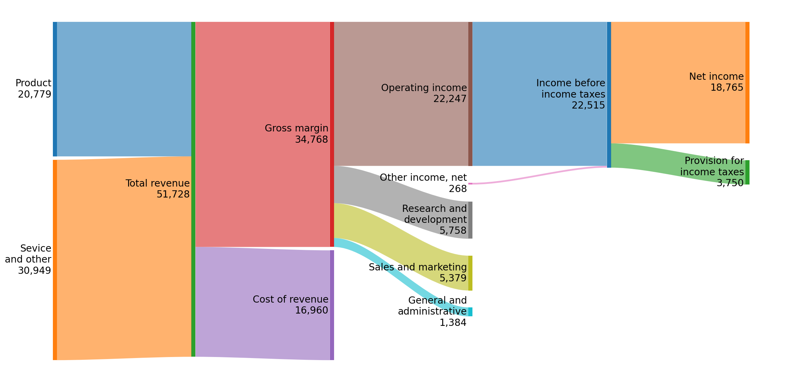
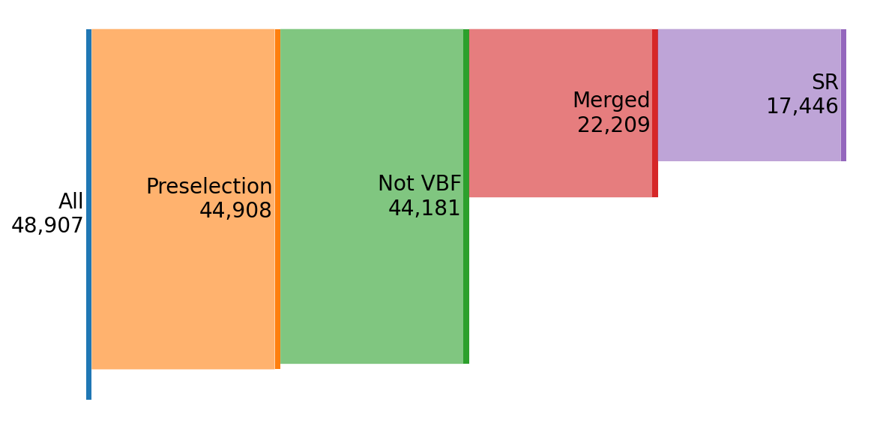
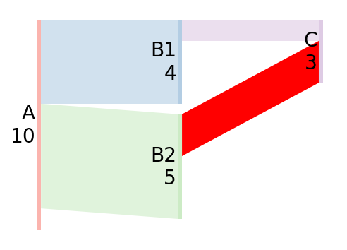
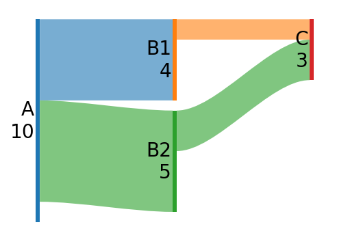
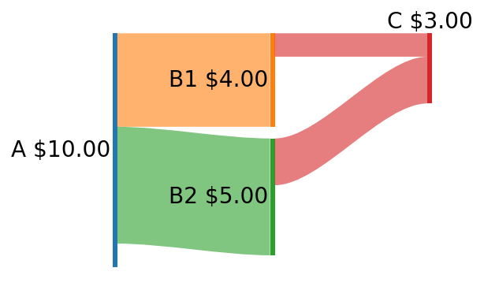

# SankeyFlow

SankeyFlow is a lightweight python package that plots [Sankey flow diagrams](https://en.wikipedia.org/wiki/Sankey_diagram) using Matplotlib.



```py
from sankeyflow import Sankey

nodes = [
    [('Product', 20779), ('Sevice and other', 30949)],
    [('Total revenue', 51728)],
    ...
]
flows = [
    ('Product', 'Total revenue', 20779),
    ('Sevice and other', 'Total revenue', 30949),
    ...
]
s = Sankey(flows=flows, nodes=nodes)
s.draw()
plt.show()
```
See [example/msft_FY22q2.py](example/msft_FY22q2.py) for full example.

## Description

While MPL does have a builtin sankeyflow class, it is only capable of a single node. SankeyFlow allows for any number of nodes and flows between them. It also treats nodes and flows separately, so the node value, inflows, and outflows don't have to be equal. However, automatic node inference is also available (TODO). 



SankeyFlow is also fully transparent with Matplotlib; the sankey diagram requires only an axis to be drawn: `Sankey.draw(ax)`. All elements in the diagram are Matplotlib primitives (`Patch` and `Text`), and can be directly modified with the full suite of Matplotlib options.

## Installation

Requires Matplotlib and numpy.
```bash
python3 -m pip install sankeyflow
```
You can then simpliy
```py
from sankeyflow import Sankey
```

## Usage

The core class is `sankeyflow.Sankey`, which builds and draws the diagram. Data is passed in the constructor or with `Sankey.sankey(flows, nodes)`, and the diagram is drawn with `Sankey.draw(ax)`.

The diagram defaults to a left-to-right flow pattern, and breaks the nodes into "levels," which correspond to the x position. The cutflow diagram above has 5 levels, for example.

`nodes` is a nested list of length `nlevels`, ordered from left to right. For each level, there is a list of nodes ordered from top to bottom. Each node is a `(name, value)` pair.

`flows` is a list of flows, coded as `(source, destination, value)`. `source` and `destination` should match the `name`s in `nodes`.

If `nodes` is `None`, the nodes will be automatically inferred and placed from the flows (TODO).

```
nodes = [
    [('A', 10)],
    [('B1', 4), ('B2', 5)],
    [('C', 3)]
]
flows = [
    ('A', 'B1', 4),
    ('A', 'B2', 5),
    ('B1', 'C', 1),
    ('B2', 'C', 2),
] 

plt.figure(figsize=(4, 3), dpi=144)
s = Sankey(flows=flows, nodes=nodes)
s.draw()
```


### Configuration

Diagram and global configuration are set in the constructor. Individual nodes and flows can be further modified by adding a dictionary containing configuration arguments to the input tuples in `Sankey.sankey()`. See docstrings for complete argument lists. 

For example, we can change the colormap to pastel, make all flows not curvy, and change the color of one flow.
```py
flows = [
    ('A', 'B1', 4),
    ('A', 'B2', 5),
    ('B1', 'C', 1),
    ('B2', 'C', 2, {'color': 'red'}),
] 

s = Sankey(
    flows=flows,
    nodes=nodes,
    cmap=plt.cm.Pastel1,
    flow_opts=dict(curvature=0),
)
s.draw()
```



By default the color of the flows is the color of the destination node. This can be altered globally or per-flow with `flow_color_mode`. 
```py
flows = [
    ('A', 'B1', 4),
    ('A', 'B2', 5, {'flow_color_mode': 'dest'}),
    ('B1', 'C', 1),
    ('B2', 'C', 2),
] 

s = Sankey(
    flows=flows,
    nodes=nodes,
    flow_color_mode='source',
)
s.draw()
```



We can also easily adjust the label formatting and other node properties in the same way.
```py
nodes = [
    [('A', 10)],
    [('B1', 4), ('B2', 5)],
    [('C', 3, {'label_pos':'top'})]
]
flows = [
    ('A', 'B1', 4),
    ('A', 'B2', 5),
    ('B1', 'C', 1),
    ('B2', 'C', 2),
] 

s = Sankey(
    flows=flows,
    nodes=nodes,
    node_opts=dict(label_format='{label} ${value:.2f}'),
)
s.draw()
```



